# COMPUTER SYSTEM OVERVIEW 1-1

## OS가 하는 일


- exploits (활용): hardware resources
- provides(제공): a set of services to system users
- Manges(관리): secondary memory & I/O devices


### 1. **Exploits (활용): Hardware resources**

- **예시**: 사용자가 워드 프로세서에서 글을 작성할 때, 운영체제는 CPU를 활용해 프로그램을 실행하고, RAM을 활용해 작성 중인 문서를 임시로 저장합니다.
- 즉, OS는 하드웨어 자원을 직접 다루지 않고, 프로그램이 쉽게 쓸 수 있도록 중간에서 관리·활용합니다.

---

### 2. **Provides (제공): Services to system users**

- **예시**: 파일을 저장할 때, 사용자는 단순히 "저장" 버튼을 누르지만 실제로는 운영체제가 파일 시스템 서비스를 제공하여 하드디스크에 데이터를 기록합니다.
- 또 다른 예로, 네트워크 연결 서비스가 있어야 웹 브라우저가 인터넷에 접속할 수 있습니다.

---

### 3. **Manages (관리): Secondary memory & I/O devices**

- **예시**:
    - 운영체제는 하드디스크(secondary memory)에 어떤 파일이 어디에 저장될지 관리합니다.
    - 프린터 같은 I/O 장치를 사용할 때, 여러 프로그램이 동시에 출력 요청을 해도 운영체제가 순서를 정해 충돌 없이 출력되도록 관리합니다.

---


## 1.1 컴퓨터 시스템의 기본 요소 (Basic Elements)

컴퓨터 시스템은 크게 4가지 핵심 요소로 구성됩니다.

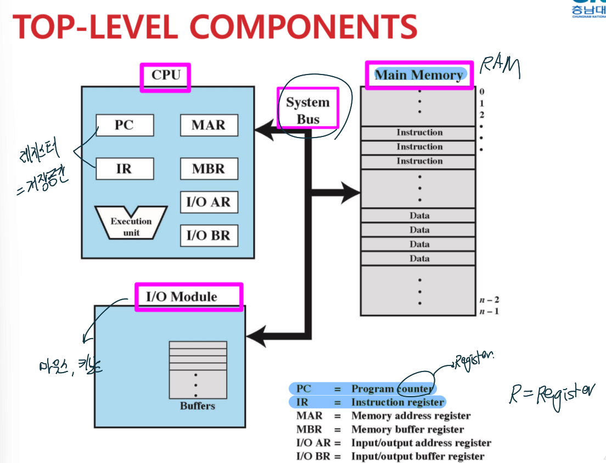


### 1. 컴퓨터 시스템의 4대 핵심 구성 요소

컴퓨터는 크게 네 가지 요소가 시스템 버스를 통해 연결되어 상호작용합니다.

- **프로세서 (CPU):** 시스템의 두뇌. 제어장치(CU), 연산장치(ALU), 레지스터로 구성되며 데이터 처리와 제어를 담당합니다.
    
- **메인 메모리 (Main Memory):** 실행 중인 프로그램과 데이터를 보관하는 **휘발성** 작업 공간(Primary Memory)입니다.
    
- **I/O 모듈 (입출력 모듈):** 보조기억장치(HDD/SSD)나 외부 기기(키보드, 마우스 등)와 시스템을 연결합니다.
    
- **시스템 버스 (System Bus):** 위 장치들이 데이터를 주고받는 통로입니다.
    

---

### 2. CPU 내부의 주요 레지스터 (Registers)

레지스터는 CPU 내부에 있는 가장 빠른 임시 저장소입니다. 용도에 따라 다음과 같이 나뉩니다.

#### 📋 명령어 및 제어 관련

- **PC (Program Counter):** **다음에 실행할** 명령어의 주소를 가리킵니다. 명령어를 가져오면 자동으로 값이 증가합니다.
    
- **IR (Instruction Register):** 메모리에서 방금 가져온 **명령어 자체**를 임시로 저장합니다.
    

#### 💾 메모리 데이터 교환 관련

- **MAR (Memory Address Register):** 읽거나 쓸 **메모리의 주소**를 보관합니다.
    
- **MBR (Memory Buffer Register):** 메모리에서 읽어온 데이터나 메모리에 쓸 **데이터 내용**을 임시로 보관합니다.
    

#### 🔌 I/O 장치 상호작용 관련

- **I/O AR (Address Register):** 특정 입출력 장치의 주소를 지정합니다.
    
- **I/O BR (Buffer Register):** 입출력 장치와 주고받는 데이터를 임시 저장합니다.
    

---

### 3. 실습 예시: 엑셀(Excel) 실행 시 데이터 흐름

사용자가 엑셀 파일을 더블클릭하여 실행할 때, 데이터는 **[보조기억장치 → 메인 메모리 → CPU]** 순으로 이동합니다.

|**단계**|**주체**|**작동 방식**|**비유**|
|---|---|---|---|
|**1단계**|**I/O 모듈**|HDD/SSD에 저장된 엑셀 파일 데이터를 읽어오도록 운영체제가 명령합니다.|창고에서 재료 꺼내기|
|**2단계**|**메인 메모리**|느린 I/O 장치 대신 CPU가 바로 접근할 수 있도록 데이터를 **RAM으로 로드(Load)**합니다.|작업대에 재료 올리기|
|**3단계**|**CPU**|메모리에 있는 명령어를 **인출(Fetch)**하고 **실행(Execute)**하여 화면에 띄웁니다.|요리사가 실제 요리하기|

---

> **💡 핵심 요약**
> 
> 결국 컴퓨터는 **"보조기억장치에 있는 데이터를 메모리로 올리고(Load), CPU가 이를 가져가서(Fetch) 처리(Execute)한다"**는 원리로 작동합니다.


---

## 1.2 명령어 실행 주기 (Instruction Cycle)

단일 명령어를 처리하는 과정을 **명령어 주기(Instruction cycle)**라고 하며, 기본적으로 두 단계로 나뉩니다.

1. **Fetch Stage (인출 단계):** 프로세서가 메모리로부터 명령어를 가져옵니다. 이때 PC가 가리키는 주소의 명령어를 가져와 IR에 넣습니다.
    
2. **Execute Stage (실행 단계):** 프로세서가 해당 명령어를 해석하고 실행합니다.
    

- 명령어의 4가지 범주:
    
    - **Processor-memory:** 프로세서와 메모리 간의 데이터 전송 (LOAD, STORE).
        
    - **Processor-I/O:** 주변 장치와의 데이터 전송.
        
    - **Data processing:** 데이터에 대한 산술 및 논리 연산 (ADD 등).
        
    - **Control:** 실행 순서 변경.
        

---

## 3. 인터럽트 (Interrupts) - 🌟 시험 출제 확률 매우 높음

대부분의 I/O 장치는 프로세서보다 속도가 훨씬 느리기 때문에, 프로세서가 I/O 작업을 마냥 기다리면 효율이 크게 떨어집니다. **인터럽트**는 이 대기 시간을 줄여 **프로세서의 활용도(utilization)를 높이기 위해** 도입되었습니다.

두가지의 과정이 있음
- fetch: 명령어를 가져오는 과정
- executes: 명령어를 실행하는 과정

그래프:
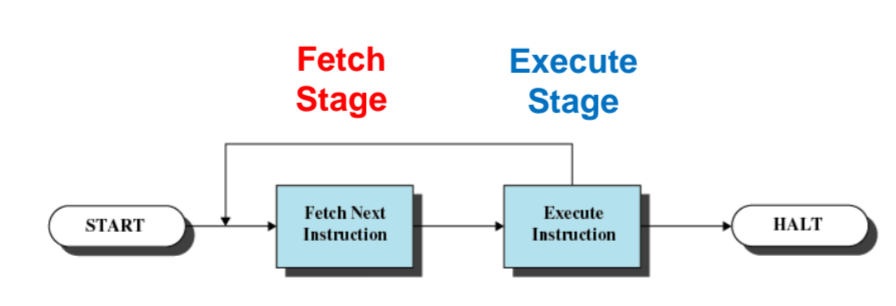


## INSTRUCTION FETCH AND EXECUTE
### 1. 명령어 인출 단계 (INSTRUCTION FETCH)

명령어 인출은 CPU가 메모리로부터 실행할 명령어를 가져오는 첫 번째 단계입니다. 이 과정에서 가장 핵심적인 역할을 하는 것이 바로 **PC(Program Counter)** 입니다.

- **PC의 역할:** PC는 **'다음에 가져올(fetch) 명령어의 주소값'**을 저장하고 있는 레지스터입니다.
    
- **자동 증가(Incremented):** CPU가 PC가 가리키는 주소에서 명령어를 성공적으로 메모리로부터 가져오고 나면, **PC의 값은 다음 명령어를 가리키기 위해 자동으로 증가(incremented)** 합니다. 필기하신 내용처럼 보통 다음 줄로 넘어가기 위해 '자동으로 1 증가'하게 됩니다.
    
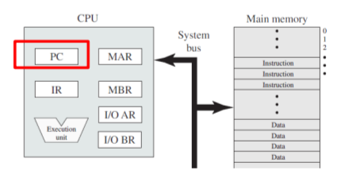

### 💡 깨알 필기 디테일 (메모리 단위)

오른쪽에 적어두신 메모리 용량/크기를 나타내는 단위 필기도 아주 중요합니다. 주소 공간이나 메모리 크기를 계산할 때 자주 쓰입니다.

- $2^{10} = K$ (Kilo)
    
- $2^{20} = M$ (Mega)
    
- $2^{30} = G$ (Giga)
    

---

### 2. 명령어 레지스터 저장 및 실행 (INSTRUCTION REGISTER)

메모리에서 가져온(Fetched) 명령어는 이제 실행을 위해 CPU 내부의 **IR(Instruction Register)** 이라는 곳에 배치됩니다.

- **PC $\rightarrow$ IR의 의미:**  `PC -> IR`은 "PC가 가리키던 주소에 있던 명령어가 CPU 내부로 인출되어 최종적으로 IR(명령어 레지스터)에 담긴다는 의미
    

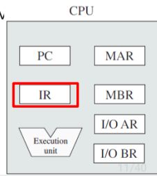


### 프로그램 실행 예제 상세 분석

우리가 흔히 쓰는 프로그래밍 언어로 작성된 코드가 CPU 내부에서 어떻게 쪼개져서 실행되는지 보여주는 아주 중요한 예제입니다.

#### 1. 고수준 코드 (High-Level Code)

먼저, 사용자가 작성한 기본 코드입니다.


```C
a = 3;
b = 2;
b = a + b;
```

이 코드는 최종적으로 3과 2를 더해 그 결괏값인 5를 변수 `b`에 저장하는 것이 목적입니다.

#### 2. 명령어(Instruction)의 구조

컴퓨터가 위 코드를 처리하기 위해, 코드는 기계가 이해하기 쉬운 **어셈블리어(Assembly)** 형태의 명령어로 변환됩니다 (필기 참고). 슬라이드 하단에 그려진 것처럼, 하나의 명령어(Instruction)는 두 가지 핵심 요소로 구성됩니다.
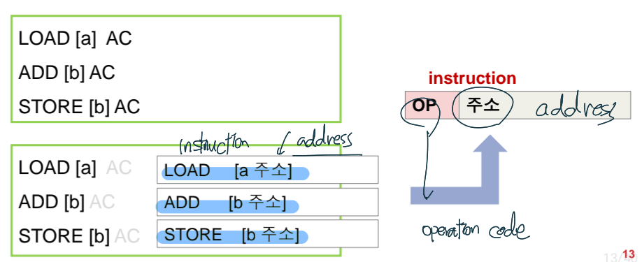


- **OP (Operation Code / 연산 코드):** 컴퓨터에게 "무엇을 할지" 지시하는 명령어입니다 (예: `LOAD`, `ADD`, `STORE`).
    
- **주소 (Address / Operand):** 연산의 대상이 되는 데이터가 실제로 들어있는 메모리상의 위치입니다 (예: `[a 주소]`, `[b 주소]`).
    

#### 3. AC (Accumulator) 레지스터의 역할

슬라이드 우측 상단에 밑줄 친 부분처럼, **AC(Accumulator)는 연산 결과를 임시로 저장하는 레지스터**입니다. 
CPU는 메모리에 있는 두 숫자를 그 자리에서 바로 더할 수 없습니다. 따라서 숫자들을 CPU 내부(AC 레지스터)로 일단 가져온 뒤 더하고, 그 결과를 다시 메모리로 돌려보내는 방식을 사용합니다. 슬라이드 우측 중앙에 직접 그리신 CPU 스케치가 바로 이 흐름을 완벽하게 보여줍니다.

#### 4. 3단계 상세 실행 과정

코드의 `b = a + b` 부분은 내부적으로 아래와 같이 3줄의 명령어로 나뉘어 실행됩니다.


```
LOAD  [a 주소] 
ADD   [b 주소] 
STORE [b 주소]
```

- **1단계 `LOAD [a 주소]`**: 메모리에 있는 'a의 주소'를 찾아가서, 그곳에 있는 데이터(3)를 CPU 내부의 AC 레지스터로 불러옵니다(Load).
    
- **2단계 `ADD [b 주소]`**: 메모리에 있는 'b의 주소'를 찾아가서 그곳에 있는 데이터(2)를 가져온 뒤, 현재 AC에 들어있는 값(3)에 더합니다(Add). (이때 결괏값인 5는 AC 레지스터에 임시로 저장되어 있습니다 ).
    
- **3단계 `STORE [b 주소]`**: AC 레지스터에 보관 중인 덧셈의 최종 결괏값(5)을 메모리의 'b의 주소'에 덮어써서 저장합니다(Store). 그려주신 스케치에서 `5 ➔ store ➔ b`로 표현하신 부분이 바로 이 마지막 단계입니다.
    


## characteristics of a hypothetical machine
### 1. 16비트 가상 머신 개요

이 시스템은 컴퓨터가 처리하는 **명령어(Instruction)와 데이터(Data)가 모두 16비트 길이**로 설계된 환경을 가정합니다.

### 2. 명령어 형식 (Instruction Format)

CPU가 실행할 명령어 16비트는 역할에 따라 두 구역으로 나뉩니다.

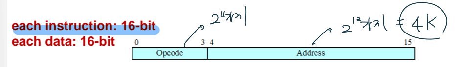

- **Opcode (연산 코드, 4-bit):** 명령어의 앞 4비트(0~3번)는 프로세서가 수행할 연산의 종류를 정의합니다.
    
    - **시험 포인트:** 4비트로 표현할 수 있는 경우의 수는 $2^4$이므로, 이 컴퓨터가 가질 수 있는 **가능한 Opcode의 개수는 총 16가지**입니다.
        
- **Address (주소, 12-bit):** 명령어의 뒤 12비트(4~15번)는 해당 연산에 사용할 데이터가 들어있는 메모리의 주소를 지정합니다.
    
    - **시험 포인트:** 12비트로 표현할 수 있는 경우의 수는 $2^{12}$이므로, 이 컴퓨터가 **Access 가능한 주소 공간의 크기는 총 4K (4096개)**입니다.
        

### 3. 정수 데이터 형식 (Integer Format)

숫자 데이터 역시 16비트 공간에 저장되며, 부호와 크기로 나뉩니다.
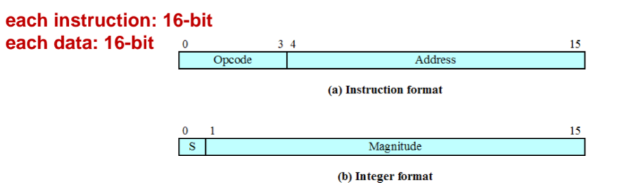

- **부호 (S, 1-bit):** 맨 앞 1비트(0번 비트)는 숫자가 양수인지 음수인지를 판별하는 부호(Sign) 비트입니다.
    
- **크기 (Magnitude, 15-bit):** 나머지 15비트(1~15번 비트)는 실제 숫자의 절댓값(크기)을 나타냅니다.
    

### 4. 내부 레지스터와 명령어 규약

CPU가 이 16비트 명령어를 처리하기 위해 사용하는 핵심 레지스터와 기본 약속(Opcode)입니다.

- **주요 레지스터**
    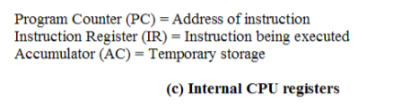
    - **PC (Program Counter):** 다음에 실행할 명령어의 주소를 기억합니다.
        
    - **IR (Instruction Register):** 현재 실행 중인 명령어를 임시로 담아둡니다.
        
    - **AC (Accumulator):** 연산 결과를 임시로 저장하는 작업용 레지스터입니다.
        
- **주요 Opcode 약속**
    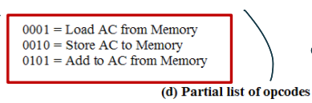
    - **0001 (Load):** 지정된 메모리 주소에서 데이터를 읽어와 AC에 넣습니다.
        
    - **0010 (Store):** AC에 들어있는 데이터를 지정된 메모리 주소에 저장합니다.
        
    - **0101 (Add):** 지정된 메모리 주소에서 데이터를 읽어와 현재 AC의 값에 더합니다.
        


    

> 인터럽트 처리 과정 (Instruction Cycle with Interrupts)

기본 명령어 주기(Fetch ➔ Execute)에 **Interrupt Stage**가 추가됩니다.

1. 프로세서가 현재 명령어 실행을 완료합니다.
    
2. 대기 중인 인터럽트가 있는지 확인합니다.
    
3. 인터럽트가 있다면 현재 프로그램의 실행을 일시 중단하고, **현재 상태 정보(PSW와 PC)를 제어 스택(Control stack)에 저장(push)** 합니다.
    
4. 인터럽트 성격에 맞는 PC 값을 새로 로드하여 **인터럽트 핸들러(Interrupt Handler)를 실행**합니다. (인터럽트 핸들러: OS의 일부로 해당 I/O 장치를 서비스하는 프로그램 ).
    
5. 인터럽트 처리가 끝나면 스택에 저장해둔 기존 PSW와 PC 값을 복원하여 원래 프로그램을 재개합니다.
    

=========

네, 올려주신 이 예제(Figure 1.4)는 **명령어 인출(Fetch)과 실행(Execute) 주기**를 완벽하게 보여주는 컴퓨터 구조의 가장 핵심적인 장표입니다. 필기하신 "fetch $\rightarrow$ exe" 흐름과 "자동증가"의 개념이 어떻게 맞물려 돌아가는지 한눈에 파악할 수 있도록, 직관적인 표 형태로 정리해 드릴게요.

먼저 코드가 실행되기 전, CPU와 메모리의 **사전 약속(세팅)**을 머릿속에 넣어두면 표를 이해하기 훨씬 쉽습니다.

### 📝 사전 세팅 (머릿속에 넣어둘 약속)

- **목표 연산:** $a=3$; $b=2$; $b=a+b$;
    
- **데이터의 위치:** 변수 $a$의 데이터(`0003`)는 메모리 **940번지**에, 변수 $b$의 데이터(`0002`)는 메모리 **941번지**에 저장되어 있습니다.
    
- **명령어 암호(Opcode):** * `1`: 메모리에서 AC로 가져오기 (Load)
    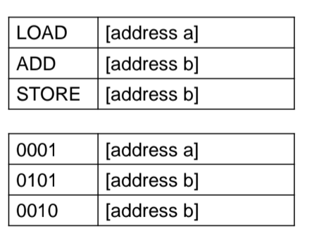                                                                                
    - `5`: 메모리 값을 AC에 더하기 (Add)
        
    - `2`: AC의 값을 메모리에 저장하기 (Store)
        

---

### 🚀 프로그램 실행 6단계 상세 표

프로그램은 메모리 300번지부터 시작하며, 인출(Fetch)과 실행(Execute)을 번갈아 가며 3번 반복합니다.
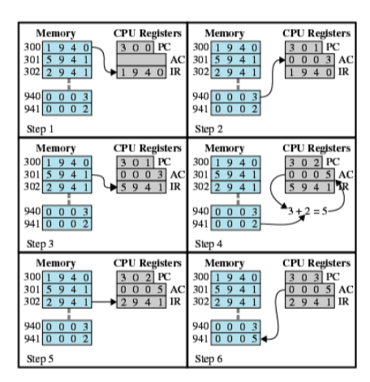


| **단계**     | **동작 구분**        | **PC (다음 실행 주소)** | **IR (현재 명령어)** | **AC (임시 저장소)** | **핵심 동작 설명 (필기하신 디테일 반영!)**                                                                                                 |
| ---------- | ---------------- | ----------------- | --------------- | --------------- | --------------------------------------------------------------------------------------------------------------------------- |
| **Step 1** | **Fetch** (인출)   | **301** (자동 1 증가) | `1940`          | -               | PC가 가리키던 300번지에서 명령어 `1940`을 IR로 가져옵니다. 필기하신 대로 PC는 **다음 명령어 주소인 301로 자동 증가**합니다.                                           |
| **Step 2** | **Execute** (실행) | 301               | `1940`          | **0003**        | IR의 `1940`을 해석합니다. "**1(Load)** 하라, **940번지**에서"라는 뜻이므로, 메모리 940번지에 있던 값 **3**을 AC 레지스터로 불러옵니다.                             |
| **Step 3** | **Fetch** (인출)   | **302** (자동 1 증가) | `5941`          | 0003            | PC가 가리키는 301번지에서 다음 명령어 `5941`을 IR로 가져옵니다. PC는 302로 또 증가합니다.                                                                |
| **Step 4** | **Execute** (실행) | 302               | `5941`          | **0005**        | IR의 `5941`을 해석합니다. "**5(Add)** 하라, **941번지** 값을"이라는 뜻이므로, 941번지에 있던 값 2를 현재 AC에 있는 3과 더합니다 ($3+2=5$). 결괏값 **5**가 AC에 저장됩니다. |
| **Step 5** | **Fetch** (인출)   | **303** (자동 1 증가) | `2941`          | 0005            | PC가 가리키는 302번지에서 마지막 명령어 `2941`을 IR로 가져옵니다. PC는 303으로 증가합니다.                                                                |
| **Step 6** | **Execute** (실행) | 303               | `2941`          | 0005            | IR의 `2941`을 해석합니다. "**2(Store)** 하라, **941번지**에"라는 뜻입니다. 현재 AC에 있는 덧셈 결과인 **5**를 메모리 941번지(변수 $b$의 자리)에 덮어씌워 저장합니다.         |

---


### 명령어 레지스터 (Instruction Register)

메모리에서 인출된(Fetched) 명령어는 실행되기 직전에 CPU 내부의 **명령어 레지스터(IR)** 에 배치됩니다.

명령어의 4가지 범주 (Instruction Categories)

IR에 들어온 명령어는 그 목적에 따라 다음 4가지로 나뉩니다.

- 1. Processor-memory (프로세서-메모리)
    
    - **개념:** 프로세서(CPU)와 메모리 사이에서 데이터를 전송합니다.
        
    - **필기 매칭:** 적어주신 `메인메모리 ↔ CPU` 흐름 그대로입니다. 앞서 보았던 `LOAD`(메모리에서 CPU로)와 `STORE`(CPU에서 메모리로)가 대표적인 예시입니다.
        
- 2. Processor-I/O (프로세서-입출력장치)
    
    - **개념:** 주변 장치(Peripheral device)와 데이터를 주고받습니다.
        
    - **필기 매칭:** 적어주신 `I/O ↔ CPU` 흐름입니다. 하드디스크나 모니터, 키보드 같은 외부 장치와 통신할 때 사용됩니다.
        
- 3. Data processing (데이터 처리)
    
    - **개념:** 데이터에 대한 산술 연산(Arithmetic)이나 논리 연산(Logic operation)을 수행합니다.
        
    - **필기 매칭:** 옆에 적어두신 `add, reverse, shift`가 아주 정확한 예시입니다! 더하고(`add`), 비트를 뒤집고(`reverse`), 자리를 이동시키는(`shift`) 등 실제 계산을 수행하는 명령어들입니다.
        
- 4. Control (제어)
    
    - **개념:** 프로그램의 정상적인 실행 순서(sequence)를 변경합니다. (예: 조건문이나 반복문으로 인해 다음 줄이 아닌 다른 곳으로 점프).
        
    - **필기 매칭:** `연산후 운영체계 반환`이라고 훌륭하게 적어주셨네요. 단순히 순서대로 명령어를 처리하는 것을 넘어, 실행 순서를 바꿔 특정 위치로 이동하거나, 모든 작업이 끝나고 프로그램 제어권을 다시 운영체제(OS)로 넘겨줄 때 이 제어 명령어가 사용됩니다.

---

## 1.4 INTERRUPTS (인터럽트)

### **1. 인터럽트의 개념과 목적**

대부분의 I/O(입출력) 장치는 프로세서(CPU)보다 속도가 느립니다. 프로세서가 I/O 장치의 작업이 끝날 때까지 기다리며 멈춰있게 되면 효율이 떨어지기 때문에, 프로세서의 활용도를 높이기 위한 방법으로 인터럽트가 제공됩니다. 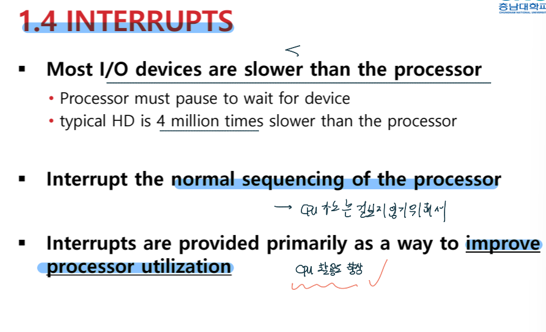

### **2. 인터럽트의 분류**

인터럽트는 발생 시점과 원인에 따라 크게 두 가지로 나뉩니다.

- **동기 인터럽트 (Synchronous Interrupts)**
    
    - CPU가 명령어를 실행하는 과정이나 실행 직후에 처리됩니다.
        
    - 현재 실행 중인 프로그램의 명령어에 의해 발생합니다.
        
    - 예외(Exception), Memory Fault, Trap, 소프트웨어 인터럽트(Software interrupt) 등이 이에 해당합니다 (예: divide by zero, overflow ).
        
- **비동기 인터럽트 (Asynchronous Interrupts)**
    
    - 실행 중인 명령어와는 독립적으로 언제든지 발생할 수 있습니다.
        
    - CPU 외부의 장치나 이벤트(하드웨어 인터럽트, I/O 관련)에 의해 발생합니다.
        

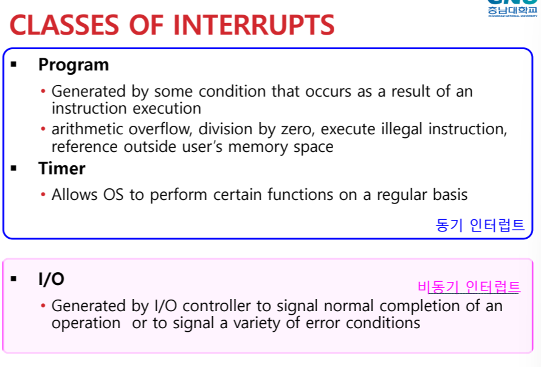

**[발생 원인별 주요 클래스]**

- **Program:** 산술 오버플로우, 0으로 나누기 등 명령어 실행 결과로 발생하는 조건에 의해 생성됩니다.
    
- **Timer:** 운영체제(OS)가 특정 기능을 정기적으로 수행할 수 있도록 해줍니다.
    
- **I/O:** I/O 컨트롤러가 작업의 정상 완료나 다양한 에러 상태를 알리기 위해 생성합니다.
    

---

### **3. 프로그램 제어 흐름 (I/O 대기 시간에 따른 예제)**

**루프 예제:** `for i=0..1000` 번 반복하면서 `write_to_printer()`를 호출하는 상황. 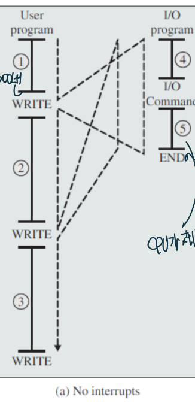

**(a) 인터럽트 없는 경우 (No interrupts)**

- **흐름 요약:**
    
    - ① User Program 실행: CPU가 첫 번째 루프(`for i=0..1000`)를 수행합니다.
        
    - ④ `write_to_printer()` 호출: CPU가 I/O 명령을 내립니다.
        
    - **대기 (Wait):** 프린트가 완료될 때까지 CPU는 다음 작업을 하지 못하고 대기합니다. (이미지 내 "Print 하는 동안 CPU 대기" 메모 참고)
        
    - ② User Program 재개: I/O가 완료되면 CPU가 다시 두 번째 루프를 수행합니다.
        
    - 반복적으로 I/O를 요청하고 대기하는 과정이 반복됩니다.
        
- **핵심 특징:** 동기식 처리로 인해 자원 낭비가 발생하며, 프로그램 로직 순서대로 작업이 명확히 구분되어 진행되는 순차적 실행 구조를 가집니다.
    

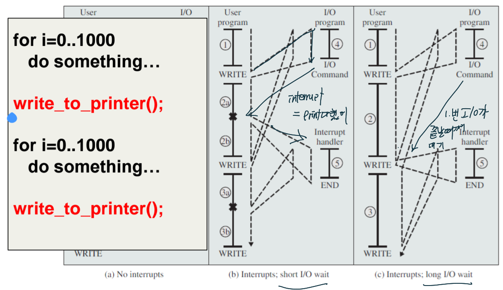

**(b) 인터럽트: Short I/O wait (I/O 작업이 짧을 때)** CPU가 다음 계산 작업을 하는 도중에 I/O가 끝나는 경우입니다.

- **흐름:**
    
    - ① User Program 실행: 첫 번째 연산 루프를 수행합니다.
        
    - `WRITE` 호출: I/O 명령을 내립니다.
        
    - ④ I/O Program (Command): I/O 장치가 동작을 시작합니다. **이때 CPU는 기다리지 않고 바로 ②a(다음 루프)를 실행합니다**.
        
    - **인터럽트 발생 (✖ 표시):** ②a 실행 도중 I/O가 완료되면, 장치가 CPU에 인터럽트 신호를 보냅니다.
        
    - ⑤ Interrupt Handler: CPU는 하던 일을 잠시 멈추고 핸들러를 실행해 I/O 마무리 작업을 수행합니다.
        
    - ②b 재개: 핸들러 작업이 끝나면 멈췄던 지점부터 다시 연산을 이어갑니다.
        

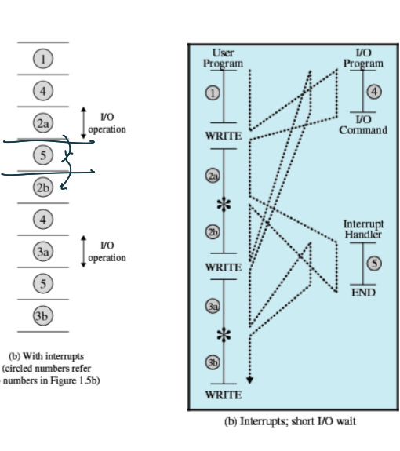

**(c) 인터럽트: Long I/O wait (I/O 작업이 길 때)** CPU가 다음 계산 작업을 다 마쳤는데도 I/O가 끝나지 않은 경우입니다.

- **흐름:**
    
    - ① User Program 실행: 첫 번째 연산 루프를 수행합니다.
        
    - `WRITE` 호출: I/O 명령을 내립니다.
        
    - ④ I/O Program (Command): I/O 장치가 동작합니다. CPU는 ②(다음 루프 전체)를 실행합니다.
        
    - **대기 (Wait):** ②번 루프가 다 끝났는데도 I/O가 완료되지 않아, CPU는 다음 `WRITE`를 하지 못하고 I/O가 끝날 때까지 대기(Processor wait)합니다.
        
    - ⑤ Interrupt Handler: I/O가 완료되어 인터럽트가 발생하면 핸들러가 실행됩니다.
        
    - ③ 재개: I/O 처리가 완전히 끝난 후 비로소 다음 루프(③)로 넘어갑니다.
        

> 💡 **핵심 차이점 요약**
> 
> - **(b) 방식:** CPU 연산 중에 인터럽트가 들어와서 작업을 끊고(**Preempt**) 처리함.
>     
> - **(c) 방식:** CPU 연산이 먼저 끝나버려 I/O 완료 인터럽트가 올 때까지 기다림(**Wait**).
>     

---

### **4. 인터럽트 처리 주기 (Instruction Cycle with Interrupts)**

기본적인 명령어 실행 주기(Fetch -> Execute)에 인터럽트 단계(Interrupt Stage)가 추가됩니다.

- 프로세서는 대기 중인 인터럽트가 있는지 확인합니다.
    
- 대기 중인 인터럽트가 없다면 현재 프로그램의 다음 명령어를 인출(Fetch)합니다.
    
- 대기 중인 인터럽트가 있다면 현재 프로그램의 실행을 중단(Interrupts Disabled)하고 인터럽트 핸들러 루틴을 실행합니다.
    
- **인터럽트 핸들러(Interrupt Handler):** 특정 I/O 장치를 서비스하기 위한 프로그램으로, 인터럽트의 특성을 파악하여 필요한 동작을 수행하며 일반적으로 운영체제(OS)의 일부입니다.
    

### **5. 인터럽트 처리 상세 과정 (Hardware & Software)**

인터럽트가 발생했을 때 하드웨어와 소프트웨어가 처리하는 단계입니다.

- **하드웨어 처리 단계 (Hardware):**
    
    1. 장치 컨트롤러나 시스템 하드웨어가 인터럽트를 발생시킵니다.
        
    2. 프로세서는 현재 명령어의 실행을 완료합니다.
        
    3. 프로세서가 인터럽트 인지를 알리는 신호(Acknowledgment)를 보냅니다.
        
    4. 프로세서는 제어 스택(control stack)에 PSW와 PC(Program Counter) 값을 푸시(저장)합니다.
        
    5. 프로세서는 인터럽트에 기반하여 새로운 PC 값을 로드합니다.
        
- **소프트웨어 처리 단계 (Software):**
    
    1. 프로세스의 나머지 상태 정보(Process state information)들을 저장합니다.
        
    2. 인터럽트를 실제 처리(Process interrupt)합니다.
        
    3. 저장해두었던 프로세스 상태 정보를 복원합니다.
        
    4. 기존의 PSW와 PC 값을 복원하여 원래 하던 작업으로 돌아갑니다.
        

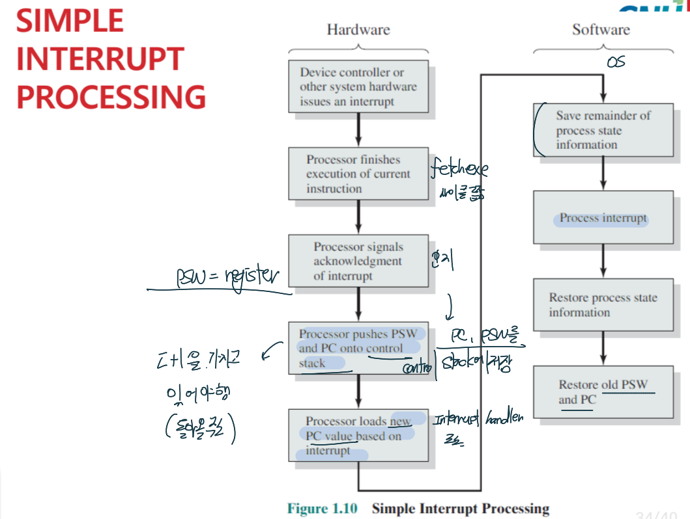
#### **[단순 인터럽트 처리 과정 요약]**

**1. 하드웨어(CPU) 측면: "작업 중단 및 백업"**

- **인터럽트 발생:** 장치 컨트롤러 등이 인터럽트 신호 전송.
    
- **명령어 완료:** 현재 진행 중인 명령어의 Fetch-Execute 사이클까지만 마침 **(필기: fetch exe 사이클 끝)**.
    
- **인터럽트 인지:** 프로세서가 장치에 확인 신호 보냄 **(필기: 인지)**.
    
- ⭐ **상태/주소 백업:** 제어 스택에 **PC와 PSW(레지스터) 저장** **(필기: 돌아올 주소를 가지고 있어야 해)**.
    
- **목적지 변경:** PC에 새로운 인터럽트 핸들러 주소 덮어쓰기 **(필기: Interrupt handler 주소)**.
    

**2. 소프트웨어(OS) 측면: "문제 해결 및 복귀"**

- **나머지 상태 저장:** 스택에 기타 프로세스 상태 정보(범용 레지스터 등) 추가 백업.
    
- **인터럽트 처리:** 실제 인터럽트 원인 해결.
    
- **나머지 상태 복원:** 처리가 끝나면 백업해둔 기타 상태 정보 원상복구.
    
- ⭐ **핵심 백업 복원:** 스택에서 원래 **PC와 PSW를 꺼내어(Pop)** 기존 작업으로 복귀.
    

---

#### ⏱️ 시간 순서로 보는 인터럽트 상태 변화 (Context Switching)
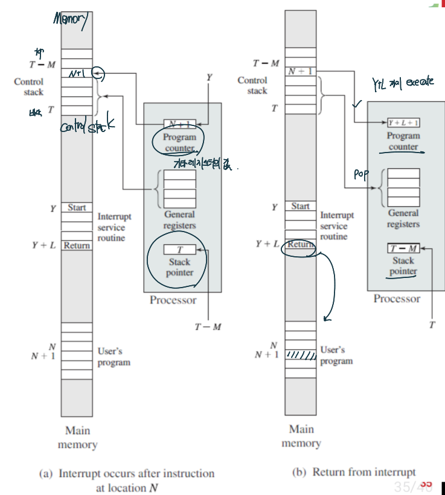

**SP(Stack Pointer)** 는 현재 제어 스택(Control Stack)의 **가장 위쪽(Top) 데이터가 있는 메모리 주소**를 들고 있는 특수 목적 레지스터입니다
##### **Step 1. 평화로운 일상 (인터럽트 발생 직전)**

CPU는 주소 `N`의 작업을 막 끝내고, 다음에 실행할 주소 `N+1`을 쥐고 있습니다. 제어 스택은 비어있는 상태입니다.

Plaintext
REG = register
```
+-----------------------+           +-----------------------+
|          CPU          |           |      Main Memory      |
+-----------------------+           +-----------------------+
| PC  : [ N + 1 ]       |           |                       | <-- SP (포인터 T)
| Reg : [ 원래 쓰던 값 ]|           |                       |
+-----------------------+           +-----------------------+
```

##### **Step 2. 비상사태 발생! (상태 백업 및 핸들러로 이동 - Push)**

인터럽트가 터졌습니다! CPU는 하던 일을 잠시 멈추고, 돌아올 주소(`N+1`)와 레지스터 값을 메모리 스택에 던져서 안전하게 백업합니다. 그리고 PC를 인터럽트 핸들러의 시작 주소(`Y`)로 바꿔치기합니다.

Plaintext

```
+-----------------------+           +-----------------------+
|          CPU          |           |      Main Memory      |
+-----------------------+           +-----------------------+
| PC  : [ Y (핸들러) ]  |   ====>   | 백업 1: [ N + 1 ]     | 
| Reg : [ 새로운 작업 ] |   ====>   | 백업 2: [ 원래 쓰던 값]| <-- SP (포인터 T-M)
+-----------------------+           +-----------------------+
                            (Push!)
```

> **💡 핵심:** 데이터가 스택에 쌓였기 때문에, 스택 포인터(SP)가 `T`에서 `T-M`으로 위로 이동했습니다.

##### **Step 3. 상황 종료 및 완벽한 복귀 (상태 복원 - Pop)**

핸들러가 끝을 알리는 `Return` 명령어에 도달했습니다. CPU는 아까 스택에 던져두었던 원래 주소(`N+1`)와 값들을 그대로 다시 꺼내옵니다(Pop).

Plaintext

```
+-----------------------+           +-----------------------+
|          CPU          |           |      Main Memory      |
+-----------------------+           +-----------------------+
| PC  : [ N + 1 ]       |   <====   | (다시 비워짐)         | <-- SP (포인터 T)
| Reg : [ 원래 쓰던 값 ]|   <====   |                       |
+-----------------------+           +-----------------------+
                            (Pop!)
```

> **💡 핵심:** 백업했던 값을 쏙 빼왔기 때문에, 스택 포인터(SP)는 원래 자리인 `T`로 되돌아옵니다. 그리고 CPU는 아무 일도 없었다는 듯 `N+1`부터 작업을 이어나갑니다.

---

### **6. 다중 인터럽트 (Multiple Interrupts)**

인터럽트 처리 중에 또 다른 인터럽트가 발생했을 때 이를 처리하는 두 가지 방법입니다.

- **순차적 인터럽트 처리 (Sequential interrupt processing)**
    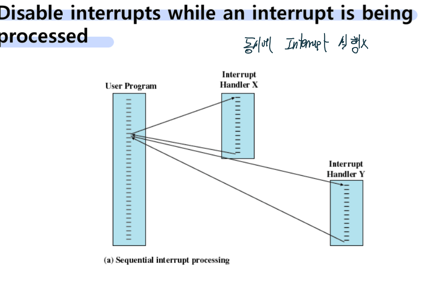
    - 인터럽트가 처리되는 동안에는 다른 인터럽트들을 비활성화(disabled)하여 무시합니다.
        
    - 인터럽트의 우선순위나 시간에 민감한(time-critical) 처리를 고려하지 못하는 단점이 있습니다.
        
- **중첩 인터럽트 처리 (Nested interrupt processing)**
    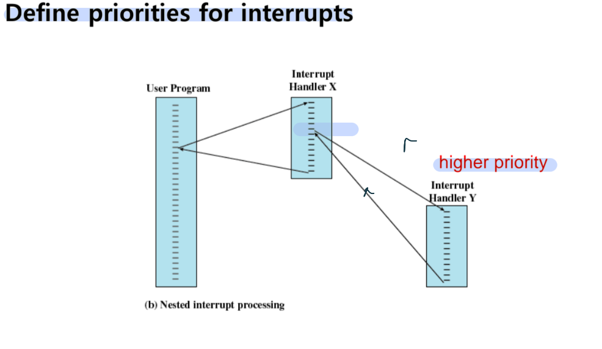
    - 인터럽트마다 우선순위(priority)를 정의해둡니다.
        
    - 처리 중인 인터럽트보다 우선순위가 더 높은(higher priority) 인터럽트가 발생하면 우선순위에 따라 먼저 처리합니다.
        
    - (예시: 프린터의 우선순위가 2, 디스크가 4, 통신이 5일 때, 프린터 인터럽트 처리 중 통신 인터럽트가 발생하면 프린터 처리를 중단하고 통신을 먼저 실행합니다.)
        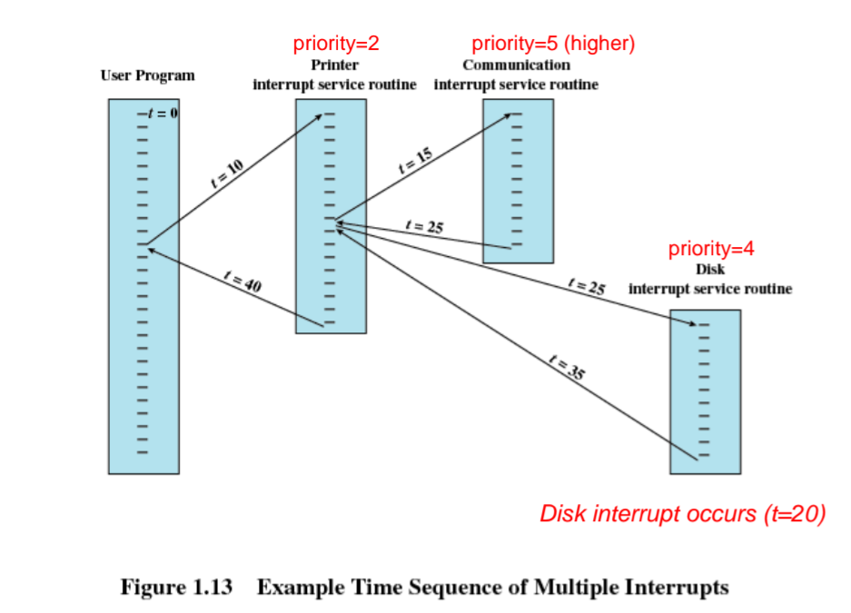
